# Configuring Dms Package
The main objetive of this guide is setting a monitoring system for our DAppNode.

**Index**   
1. [Installation of the Dappnode Exporter package](#id1)
2. [Installation of the Dms package](#id2)
3. [Intallation of Grafana with PagerDuty](#id3)

## Installation of the Dappnode Exporter package

In order to install Dappnode Exporter package, you should write in the searching bar of the DAppStore:

~~~
exporter
~~~

It will show the next package: 

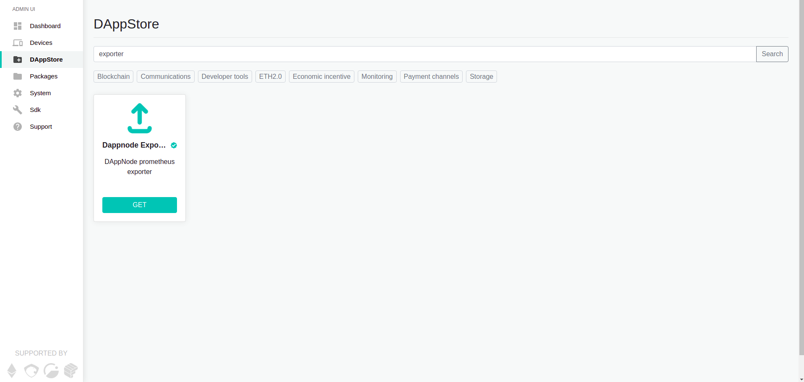

We have to click on the package called Dappnode exported. And press the INSTALL button.

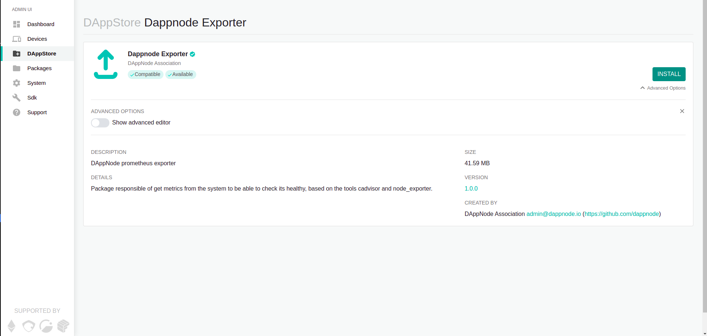

If all goes well, you will see something like the next image: 

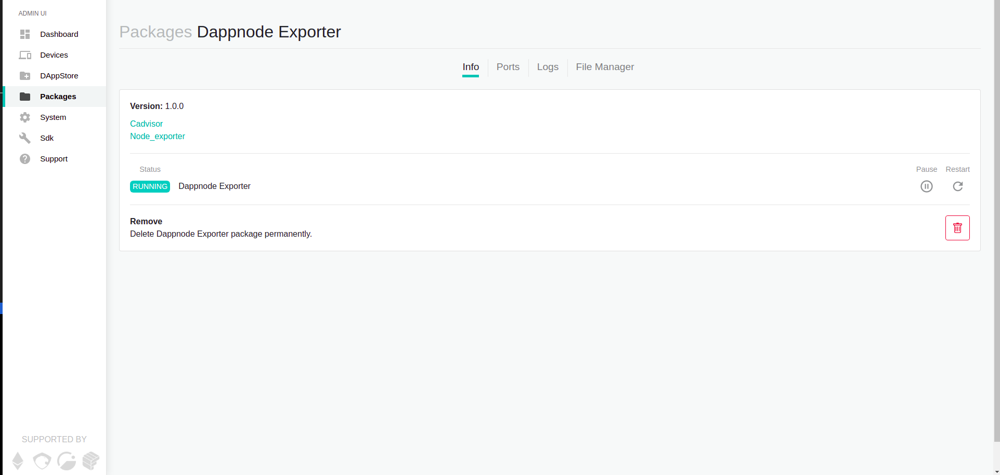

In order to check that is well installed, and show what we have installed in our dappnode, click the "Node_exporter" link, which is above of the word Status.

A new blank window will appear with a link called "Metrics", click on it and you will see something similar to:

~~~
# HELP go_gc_duration_seconds A summary of the pause duration of garbage collection cycles.
# TYPE go_gc_duration_seconds summary
go_gc_duration_seconds{quantile="0"} 8.902e-06
go_gc_duration_seconds{quantile="0.25"} 3.43e-05
go_gc_duration_seconds{quantile="0.5"} 0.000147245
go_gc_duration_seconds{quantile="0.75"} 0.000279352
go_gc_duration_seconds{quantile="1"} 0.001784388
go_gc_duration_seconds_sum 0.014444746
go_gc_duration_seconds_count 79
# HELP go_goroutines Number of goroutines that currently exist.
# TYPE go_goroutines gauge
go_goroutines 8
# HELP go_info Information about the Go environment.
# TYPE go_info gauge
go_info{version="go1.14.6"} 1
# HELP go_memstats_alloc_bytes Number of bytes allocated and still in use.
# TYPE go_memstats_alloc_bytes gauge
go_memstats_alloc_bytes 2.561768e+06
# HELP go_memstats_alloc_bytes_total Total number of bytes allocated, even if freed.
# TYPE go_memstats_alloc_bytes_total counter
...
~~~

### What is this?

They are parameters what are being recopilated by the package which we have just installed, and this package is exposing it, because on this way we can use a "tool" like grafana to collect them and monitoring the state of our machine.

The next step, it is installing the Dms package in our DappNode.( This Dms package contains that grafana tool that I mentioned before)

## Installation of the Dms package

Search in the navigation bar of the DAppStore:

Click on it and press the INSTALL button:

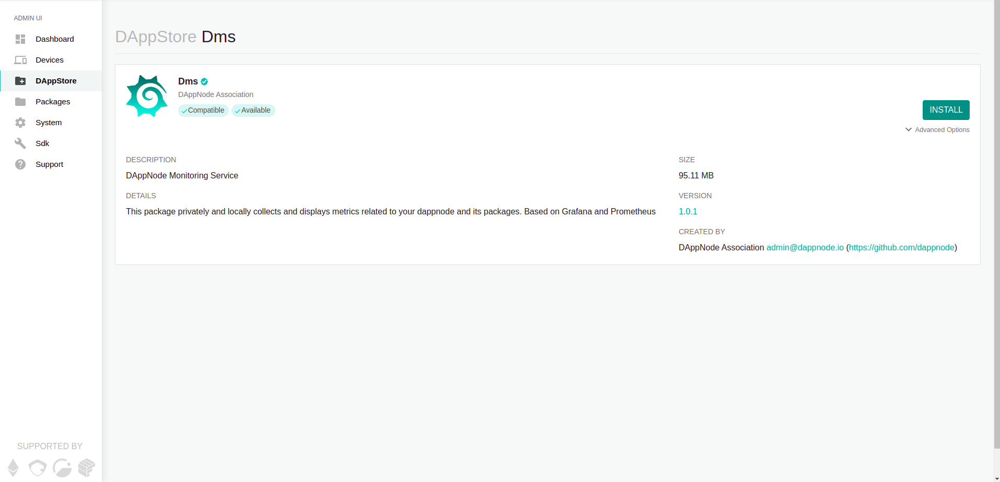

Once the installation process is finished, it will appear the next window:

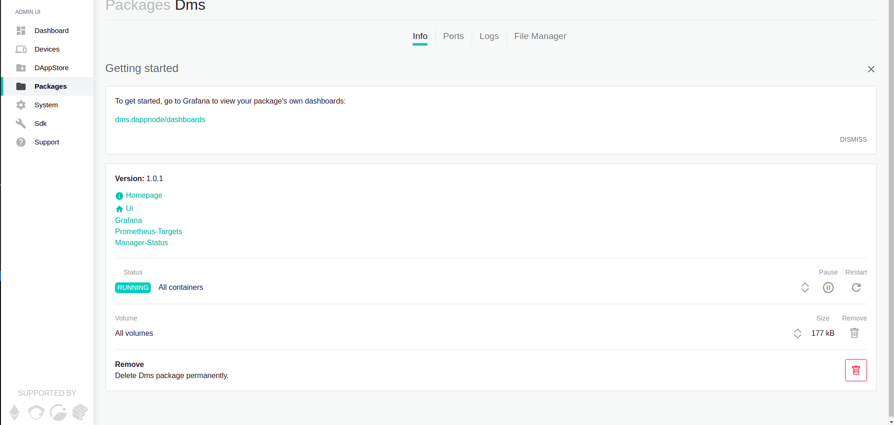

In this configuration window of the Dms package, we have several options:
* **Homepage**: This link will redirect us to the github repository of dappnode's pakage, https://github.com/dappnode/DMS#readme.
*  **Ui**: Redirect to the Web User Interface of Grafana. Specifically, to the dashboard section, it is where we can see a list with all our monitoring panels.
*  **Grafana**: Redirect to the main page of grafana.
*  **Prometheus-Targets**: Redirect to "the other side" of prometheus, when we installed the package "Node-exporter" we installed a prometheus server that exposes the metrics of our dappnode, so here we use a prometheus client to ask that metrics and process them.
*  **Manager-Status**: Show the dockers we are monitoring. All of them are collected in the dashboard "dappnode-exporter dashboard".

After explain a bit what options we had, select the option **Ui**. The next window will appear:

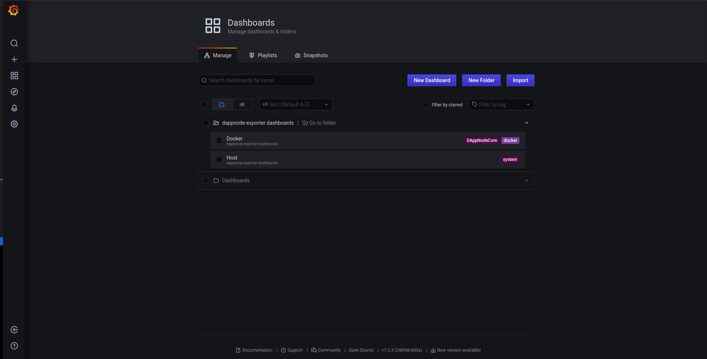

Clicking on the dappnode-exporter dashboards appears 2 options:

* **Docker**: They are the system metrics, or software metrics,i.e.,it shows how many of the machine's resources is using every package of our dappnode.
*  **Host**: They are the "hardware metrics", for example: ram usage, free disk space, network usage, etc. General metrics of our machine.

If we click in some of this option, you will se something like:

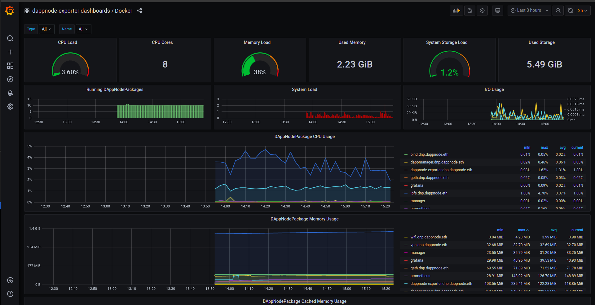

So this is all for now, you would have finished of installed the monitoring system of your dappnode.

This a little guide for people that never used programs like this.

Some of the most interesting and usefull thinks that ou can do with grafana is add alerts(telegram messages,emails, etc) in the case your dappnode has problem.

I hope this guide will be usefull for some people. 

PD: English is not my first language, sorry if I commited gramar mistakes or something is not well explained. If you have some suggestions, i am glad to read them. 

## Integrations of grafana with Pagerduty

### What is Pagerduty and for what is used?

Pagerdute is a an incident management platform that provides a notification system, let you automatize operations and so many functionalities.

Pagerduty has different packages, the free option is so good. We used the free version for this guide, if you are interested you can look for more information in [his website](https://www.pagerduty.com/pricing/).

[Here](https://support.pagerduty.com/docs/introduction) you can obtain more information abour pagerduty.

Although Pagerduty provides so many functionalities, the objetive of this guide is starting with me most basir part of it, we will implement pagerduty with our grafana in order to manage the grafana alerts.

### Creation of an account in Pagerduty

The first step is to create an account in Pagerduty, go to [the register website](https://www.pagerduty.com/sign-up/) and fill the form.

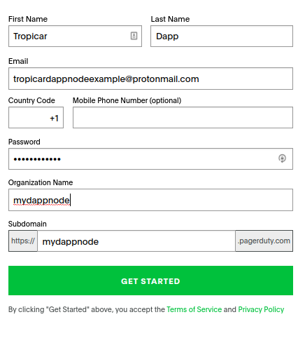

After creating our account, we can go to the subdomain which we have defined in the form, in my example would be:

~~~
https://dappnode.pagerduty.com/incidents
~~~

If you dont remember it, you will be redirected after accessing the login web of pagerduty.

### Obtain the INTEGRATION KEY

If we want to use pagerduty as channel notifications in grafana, we will ne the **Integration Key**. To obtain it we have to follow the next steps. 

After we loggin in the web for the first time, we will ne see the next page:

The first think we will do is creating an app, we have to choose the "developer mode". We can access clicking on the icon with three squares and plus sign, and selecting the option "developer mode". Like we do in the next image.

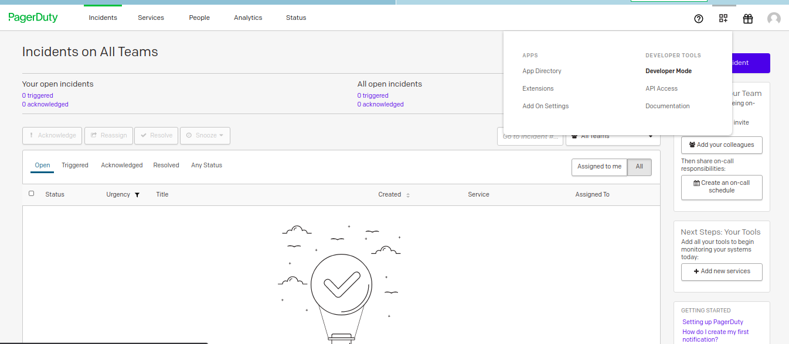

The option **Create New App** will be available. We select it and it will emerge the next form:

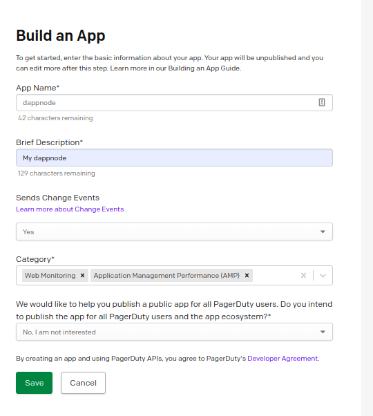

After completing the form, now you can see it in the list in **My Apps** section, where we pressed the button **Create New App** before. Something like this:

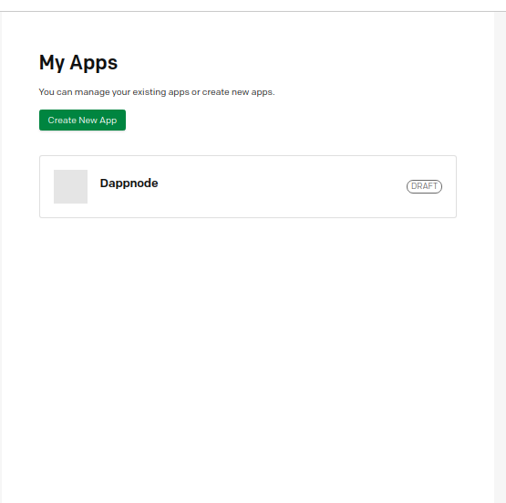

The next step is edit the data of our app, click on it, and a new form will emerge. In this form we have some known fields and new ones. The important thing here is in the **Functionality** section, we select the **Add** button in the functionality **Events Integration**.

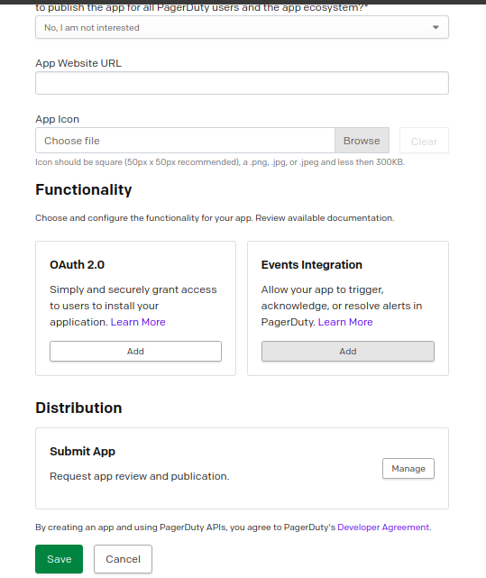

When we click on it, other form will appears to set the integration, the only think which we hae to do is press the button create in the sectión **Events Integration Test**. After cliking on it you will see the fields filled.

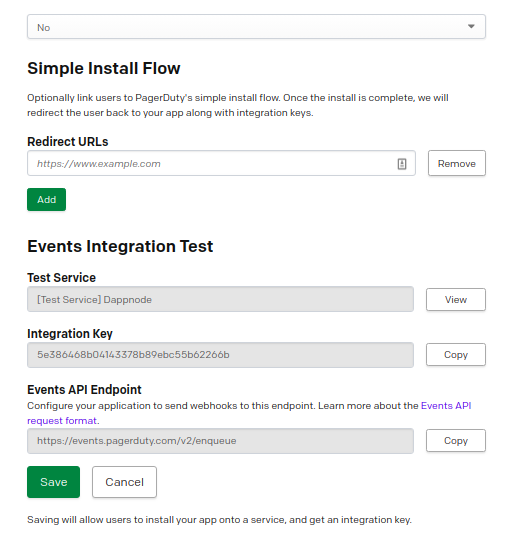

Now, copy the **Integration Key**, in this example would be:

~~~
5e386468b04143378b89ebc55b62266b
~~~

Save the changes, clicking on Save button, and once time more.

We have the Integration key. The next step is creating a notification channel in our grafana and set it with pagerduty.

### Creation of the notification channel in grafana (for pagerduty)

Open the grafana of our DAppNode, we do this DAppNode > Packages > UI. [Dappnode grafana](http://dms.dappnode/dashboards).

Choose in the left vertical bar the option Notification channels. Like in the image.

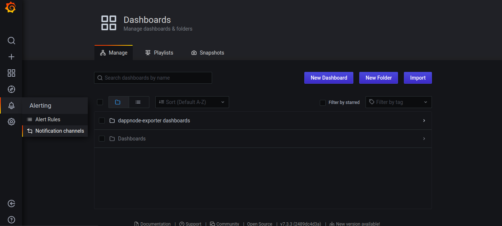

By default, we have not a one channel created. W e have to click on the button **Add Channel** to create one.

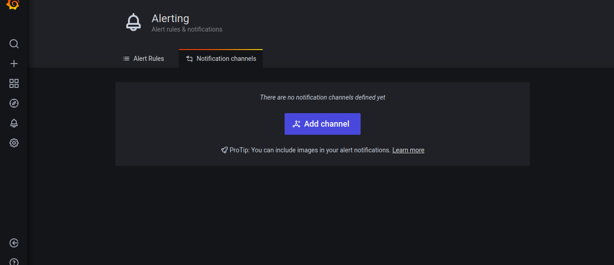

It appears the next form, the important thing here is selecting the Type = Pagerduty. And a new option will be available. In the new field Integration Key, we should paste the Integration Key which we obtained before.

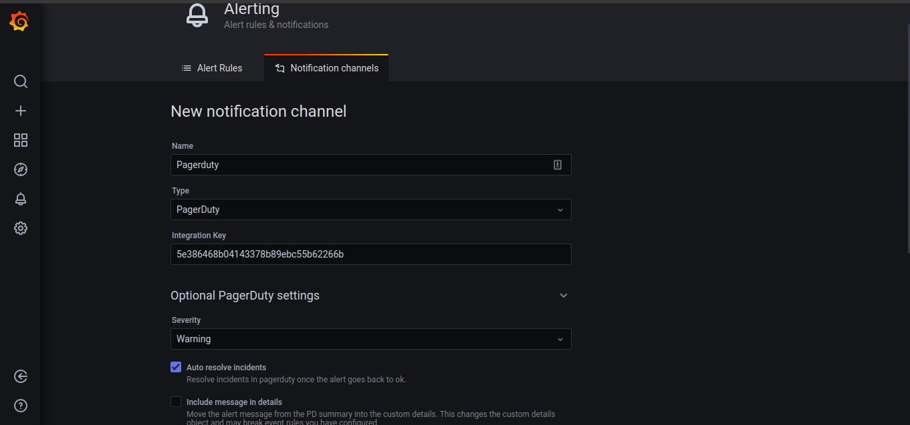

The other options are not obligated, depends of your preferences.  Before clicking on save, try the test button. 

If all went ok, you will see a green notification with the text **Send Notification**. Its a test of a notification, you can check the email which you use it for pagerduty and look for an email from pagerduty. If you received this email, it means that you set well the pagerduty integration.

Now we have to set the alerts,i.e. configure when the alerts will be sent.