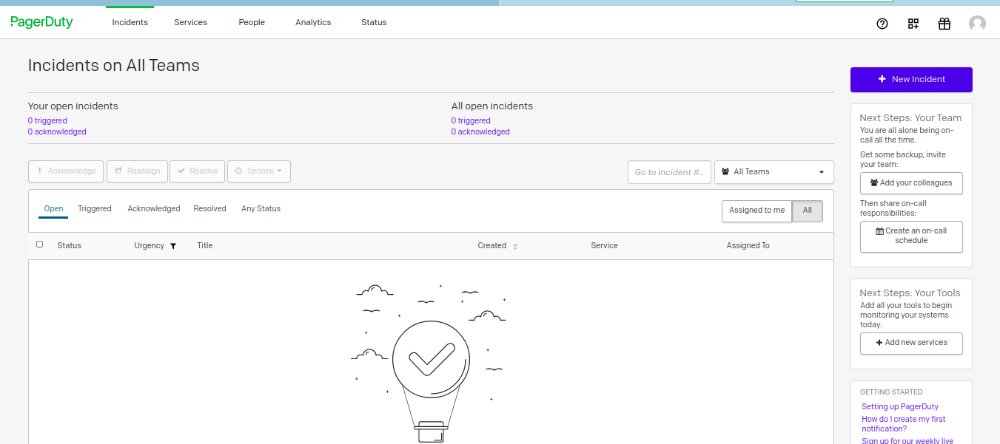

# Configuring Dms Package
The main objetive of this guide is setting a monitoring system for our DAppNode.

**Index**   
1. [Installation of the Dappnode Exporter package](#id1)
2. [Installation of the Dms package](#id2)
3. [Integration of Grafana with PagerDuty](#id3)
4. [Integration of Grafana with Telegram](#id4)
5. [Creation of alerts in Grafana](#id5)
   
## 1. Installation of the Dappnode Exporter package

In order to install Dappnode Exporter package, you should write in the searching bar of the DAppStore:

~~~
exporter
~~~

It will show the next package: 

We have to click on the package called Dappnode exported. And press the INSTALL button.

If all goes well, you will see something like the next image: 

In order to check that is well installed, and show what we have installed in our dappnode, click the "Node_exporter" link, which is above of the word Status.

A new blank window will appear with a link called "Metrics", click on it and you will see something similar to:

~~~
# HELP go_gc_duration_seconds A summary of the pause duration of garbage collection cycles.
# TYPE go_gc_duration_seconds summary
go_gc_duration_seconds{quantile="0"} 8.902e-06
go_gc_duration_seconds{quantile="0.25"} 3.43e-05
go_gc_duration_seconds{quantile="0.5"} 0.000147245
go_gc_duration_seconds{quantile="0.75"} 0.000279352
go_gc_duration_seconds{quantile="1"} 0.001784388
go_gc_duration_seconds_sum 0.014444746
go_gc_duration_seconds_count 79
# HELP go_goroutines Number of goroutines that currently exist.
# TYPE go_goroutines gauge
go_goroutines 8
# HELP go_info Information about the Go environment.
# TYPE go_info gauge
go_info{version="go1.14.6"} 1
# HELP go_memstats_alloc_bytes Number of bytes allocated and still in use.
# TYPE go_memstats_alloc_bytes gauge
go_memstats_alloc_bytes 2.561768e+06
# HELP go_memstats_alloc_bytes_total Total number of bytes allocated, even if freed.
# TYPE go_memstats_alloc_bytes_total counter
...
~~~

### What is this?

They are parameters what are being recopilated by the package which we have just installed, and this package is exposing it, because on this way we can use a "tool" like grafana to collect them and monitoring the state of our machine.

The next step, it is installing the Dms package in our DappNode.( This Dms package contains that grafana tool that I mentioned before)

## 2. Installation of the Dms package

Search in the navigation bar of the DAppStore:

Click on it and press the INSTALL button:

Once the installation process is finished, it will appear the next window:

In this configuration window of the Dms package, we have several options:
* **Homepage**: This link will redirect us to the github repository of dappnode's pakage, https://github.com/dappnode/DMS#readme.
*  **Ui**: Redirect to the Web User Interface of Grafana. Specifically, to the dashboard section, it is where we can see a list with all our monitoring panels.
*  **Grafana**: Redirect to the main page of grafana.
*  **Prometheus-Targets**: Redirect to "the other side" of prometheus, when we installed the package "Node-exporter" we installed a prometheus server that exposes the metrics of our dappnode, so here we use a prometheus client to ask that metrics and process them.
*  **Manager-Status**: Show the dockers we are monitoring. All of them are collected in the dashboard "dappnode-exporter dashboard".

After explain a bit what options we had, select the option **Ui**. The next window will appear:

Clicking on the dappnode-exporter dashboards appears 2 options:

* **Docker**: They are the system metrics, or software metrics,i.e.,it shows how many of the machine's resources is using every package of our dappnode.
*  **Host**: They are the "hardware metrics", for example: ram usage, free disk space, network usage, etc. General metrics of our machine.

If we click in some of this option, you will se something like:

So this is all for now, you would have finished of installed the monitoring system of your dappnode.

This a little guide for people that never used programs like this.

Some of the most interesting and usefull thinks that ou can do with grafana is add alerts(telegram messages,emails, etc) in the case your dappnode has problem.

I hope this guide will be usefull for some people. 

PD: English is not my first language, sorry if I commited gramar mistakes or something is not well explained. If you have some suggestions, i am glad to read them. 

## 3. Integrations of grafana with Pagerduty

### What is Pagerduty and for what is used?

Pagerdute is a an incident management platform that provides a notification system, let you automatize operations and so many functionalities.

Pagerduty has different packages, the free option is so good. We used the free version for this guide, if you are interested you can look for more information in [his website](https://www.pagerduty.com/pricing/).

[Here](https://support.pagerduty.com/docs/introduction) you can obtain more information abour pagerduty.

Although Pagerduty provides so many functionalities, the objetive of this guide is starting with me most basir part of it, we will implement pagerduty with our grafana in order to manage the grafana alerts.

### Creation of an account in Pagerduty

The first step is to create an account in Pagerduty, go to [the register website](https://www.pagerduty.com/sign-up/) and fill the form.

After creating our account, we can go to the subdomain which we have defined in the form, in my example would be:

~~~
https://dappnode.pagerduty.com/incidents
~~~

If you dont remember it, you will be redirected after accessing the login web of pagerduty.

### Obtain the INTEGRATION KEY

If we want to use pagerduty as channel notifications in grafana, we will ne the **Integration Key**. To obtain it we have to follow the next steps. 

After we loggin in the web for the first time, we will ne see the next page:

The first think we will do is creating an app, we have to choose the "developer mode". We can access clicking on the icon with three squares and plus sign, and selecting the option "developer mode". Like we do in the next image.

The option **Create New App** will be available. We select it and it will emerge the next form:

After completing the form, now you can see it in the list in **My Apps** section, where we pressed the button **Create New App** before. Something like this:

The next step is edit the data of our app, click on it, and a new form will emerge. In this form we have some known fields and new ones. The important thing here is in the **Functionality** section, we select the **Add** button in the functionality **Events Integration**.

When we click on it, other form will appears to set the integration, the only think which we hae to do is press the button create in the sectión **Events Integration Test**. After cliking on it you will see the fields filled.

Now, copy the **Integration Key**, in this example would be:

~~~
5e386468b04143378b89ebc55b62266b
~~~

Save the changes, clicking on Save button, and once time more.

We have the Integration key. The next step is creating a notification channel in our grafana and set it with pagerduty.

### Creation of the notification channel in grafana (for pagerduty)

Open the grafana of our DAppNode, we do this DAppNode > Packages > UI. [Dappnode grafana](http://dms.dappnode/dashboards).

Choose in the left vertical bar the option Notification channels. Like in the image.

By default, we have not a one channel created. W e have to click on the button **Add Channel** to create one.

It appears the next form, the important thing here is selecting the Type = Pagerduty. And a new option will be available. In the new field Integration Key, we should paste the Integration Key which we obtained before.

The other options are not obligated, depends of your preferences.  Before clicking on save, try the test button. 

If all went ok, you will see a green notification with the text **Send Notification**. Its a test of a notification, you can check the email which you use it for pagerduty and look for an email from pagerduty. If you received this email, it means that you set well the pagerduty integration.

Now we have to set the alerts,i.e. it configures when the alerts will be sent.

## 4. Integration of Grafana with Telegram

If we want to use Telegram as notification channel, we have to create a bot telegram. It is a simple process.

The first step is sending a message to the "boss" of the bots, it's called "BotFather", look for him in telegram <code>BotFather</code>.

If we type: 

~~~
/help
~~~

It shows the different tasks what we can do to manage our bots. To create a bot, we will use:

~~~
/newbot
~~~

*Alright, a new bot. How are we going to call it? Please choose a name for your bot.*

It will ask you what name do you want for your bot. 
In this case, I named <code>nameofmydappnodebot</code>.

You will see the answer:

*Good. Now let's choose a username for your bot. It must end in `bot`. Like this, for example: TetrisBot or tetris_bot.*

Type the name you want for your bot again with the restriction he says, and you will se the something like this successfull message:

~~~
Done! Congratulations on your new bot. You will find it at t.me/nameofmydappnodebot. You can now add a description, about section and profile picture for your bot, see /help for a list of commands. By the way, when you've finished creating your cool bot, ping our Bot Support if you want a better username for it. Just make sure the bot is fully operational before you do this.

*Use this token to access the HTTP API:
1377013258:AAFeUCWkKXIAIH5gXD3ImlY7JYV6CiUUDMY
Keep your token secure and store it safely, it can be used by anyone to control your bot.

For a description of the Bot API, see this page: https://core.telegram.org/bots/api
~~~

Write down the code named HTTP API, in this example it is <code>1377013258:AAFeUCWkKXIAIH5gXD3ImlY7JYV6CiUUDMY</code>.

This code is what we will use it yo set up our bot. Dont be public this code.

In order to set up Telegram as notification channel, we need this code and a id chat, the next step consists on getting that id chat.

Firstly, we create a telegram group clicking on the top-left icon:

Telegram will ask us who add to the group, we will select our new bot:

Telegram will ask you what name do you want for your group, in my case <code>Dappnode alerts group</code>. You will see something like the following image:

Now, write the followring url in the searcher nav: <code>https://api.telegram.org/bot**Here change the HTTP API of our bot**/getUpdates</code>.

In this example, la url stay: <code>https://api.telegram.org/bot**1377013258:AAFeUCWkKXIAIH5gXD3ImlY7JYV6CiUUDMY**/getUpdates</code>

If you go to the direction you will see the next:

Type a message with a slash at the start, in the group that you have created:

~~~
/helloworld
~~~

After that, visit again the url we went before, and you will see something like the following image:

Search the following field: <code>"chat":{"id":-446094679</code>, that full name(sign included) is the chat id of our telegram chat in this group. We write down that number.

Now, the next step is configuring the notification channel in grafana.

We have to go to the Grafana of our DAppNode, so we go to DAppNode > Packages > UI. [Dappnode grafana](http://dms.dappnode/dashboards).

On the left bar we select the option Notification Channels.

Click on the option **Add Channel** to create one.

We have to select the type <code>Telegram</code>, and fill the 2 fields that appears (BOT API Token and Chat ID), in our example, this would be:

**BOT API Token**: 1377013258:AAFeUCWkKXIAIH5gXD3ImlY7JYV6CiUUDMY
**Chat ID**: -446094679

In order to check if all is well set, click on the option **Send Test**, and we should receive a message in the group we have created before. Dont forget to press de button Save to save changes.

Ok, we have set our bot, but I recommend to set up some security options.

By default, our bot can be added to different groups, i.e. , anyone can add it to a group, but that is something that we dont want to.

In order to disable this configuration, we go to our chat with BotFather. And we type:

~~~
/setjoinsgroups
~~~

Select the name of your bot or the bot that you want to change this feature. After selecting it, this message appears:

~~~
Enable - bot can be added to groups.
Disable - block group invitations, the bot can't be added to groups.
Current status is: ENABLED
~~~

As you can see the current status of this feature is ENABLED, we will choose the option Disable. And the following message is showed:

~~~
Success! The new status is: DISABLED.
~~~

## 5. Creation of alerts in Grafana

Once we have configured the notification channel in Grafana, we have to set when the notifications will be sent. In this little tutorial, we will set up an basic alert. The example alert wich we will configure is an alert for when the free disk space on our disk is lower than 10 GB.

Firstly, I have to mention grafana only let us to create alerts in a panel that uses graphs. In this case, to avoid modified the dashboard by default of dappnode, we will create a panel for create the alert, for visual purposes we will create 2 rows, one for the monitoring panels and another to "hide" and order de alerts(this is optinal).

We go to the dashboard of the host in grafana, and you will se something like this:

This step is optional, but I recommend to do it because it's good to have organized the dashboard content. Click on the create a panel icon (icon in the top mid of the screen). If we press that button, it will appeard this panel:

Choose the option **convert to row**. Then, we wil see a new tab in the top of the screen with the name Row tittle, if we click on it hide or show all our panels. We can change his name selecting the wheel of configarations and typing the name we want. I named it Monitoring Panels, and press the buton update.

We repeate the last operation, creating another row and changing his name to Alerts. The result is the next:

THen we will create a new panel, but we will select the option **Add new panel** instead. The next image will appear:

On the right side, we can see 3 tabs: Panel, Field and Overrides. We are only interested in for now in Panel tab. Ww will name our panel as "Free disk space alert".

we Click on **visualization** and choose the option Graphs, as we said before we selected this option because is the only one which let us to set up alerts.

Then, go below the graph image. In the tab **query**, we select Prometheus as data provides and we type the next test as query:

~~~
sum(node_filesystem_free_bytes{mountpoint="/"})
~~~

You should be able to see the next:

Now we can see the data in the graph, we select the **Alert** tab. We press the button **create alert**. After clicking on it, we have the several options.

### What does it mean every field?

* **Name**: It's the name which you will se when you receive the alert notification.
* **Evaluate every x for y**: The system takes the data every x time, in the case the alert got triggered, this will be notified only if it continues so for y time. Define what time has to pass and stay to send a notification.
* **Conditions**: They are the rules where we define when an alert should be sent.
* **No Data & Error Handling**: We can send alert when there are data error or no data in the graph.
* **Notifications:** We can select the notification channel which we configured before. Furthermore, we can add a message to explain the alert.

We fill the fields with the next options:

**Name**: <code>Free disk space</code>   **Evaluate every** <code>1m</code> **for** <code>5m</code>

### **Conditions**

**WHEN** <code>last()</code> **OF** <code>query(A,5m,now)</code> **IS BELOW** <code>1073741824</code>

We have defined a rule when the average of the checks of free disk space along the last 5 minutes is lower than 10GB(1073741824 Bytes), the alert will be triggered.

### **No Data & Error Handling**

**If no data or all values are null** **SET STATE TO** <code>No Data</code>
**If execution error or timeoout** **SET STATE TO** <code>Alerting</code>

**Send to**: you can select the notification channel where you want to receive the alert. For example, if we have configured pagerduty, we select pagerduty.
**Message**: We can write a message about the alert. It will be shown when you receive the alert.

Te final result is the next:

The last thing you have to do here is confirm all we did pressing the button **Apply** which is on the right corner of the screen. 

After refresh the dashboard page, you should be able to see an heart icon beside the title of the grapfh. Like in this image:

If you want more information about how to create alert, i recommend reading the  [Grafana documentacion about creating alerts](https://grafana.com/docs/grafana/latest/alerting/create-alerts/).