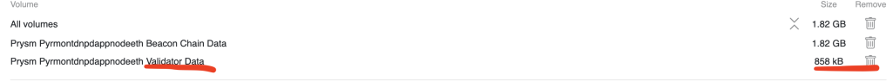

# Troubleshooting

The idea of this repo is to recopilate of the common errors that can appear and how solve them. All this information is obtained from discord's dappnode and forum.

https://medium.com/dappnode/step-by-step-staking-for-dappnode-users-92fdf7db0d0d

## Prysm 

### Error 1

~~~
Http failure response for
http://prysm.dappnode/api/v2/validator/acccount?pageSize=5:500 
Internal Server Error
~~~

The error's window would be like:

The way to solve this error is deleting the data from the validator, only the validator data and importing the keys again. In the next image we show what you have to delete, you have to be very careful with this.

After deleting the data, import again only the keystore-(...).json, NOT the entire folder.

#### Error 1.1

After doing the steps of Error 1, its possible that appears this problem along the installation:

~~~
Ports have to be opened and there is no UPnP device available
    If you are capable of opening ports manually, please ignore this error
    Your router may have UPnP but it is not turned on yet. Please research if your specific router has UPnP and turn it on

Core DAppNode Packages dappmanager.dnp.dappnode.eth, vpndnp.dappnode.eth, ipfs.dnp.dappnode.eth, bind.dnp.dappnode.eth, wifi.dnp.dappnode.eth are not found
    Make sure the disk is not too full. If so DAppNode automatically stops the IPFS package to prevent it from becoming un-usable
    Go to the System tab and restart each stopped DAppNode Package. Please inspect the logs to understand cause and report it if it was not expected.
~~~

It would correct to ensure that the open configuration is correct in your router, after that, check the state of the disk and go to the system tab and restart every package that DAppNode has stopped.

### Error 2

After installing Prysm, this error appears: 

~~~
"Call to packageInstall
Reply: Error verifying the image: image tarball must contain strictly one image"
~~~

You need to update your DAppNode! Could you go to system > auto updates and force an update.
You'll force it by untoggling the auto updates from the system packages and a banner will appear prompting you to update now
But then remember to toggle it again!

## IPFS

There is an error with some kind of routers that does not support well the protocol, they are working on it!

## Connecting using SSH

### Connecting using ssh being in a different network(LAN)

Try the command:

~~~
ssh dappnode@172.33.0.1
~~~

## Updates

### Auto-updates

DAppNode recommends to activate the auto-updates. You can activate them, toggling the bottón in the top right, in the tab system.

### Manually updates

In the case that you prefer to update manually, you have type in the search bar of the DAppStore, in the case of updating the last version of dappnode, we would type:

~~~
core.dnp.dappnode.eth
~~~

## Dappmanager

### Dappmanager permanently reseting

It's possible that you see something like this:

Its not an error, the only thing that you have to do is refresh the web. Dappmaner is showing the UI, and it does not advice you when it restarted, then, the UI is like before of restarting.

## VPN

### ¿How to generate a new VPN file?

In the case you want to reset the vpn conection, follow the next steps. Firstly, from the DAppNode's admin pannel, go to the tab "Devices", and you will see the next image:

In this section, we have several options:

* **Credentials**: we can obtain the file of the current vpn conection, by a link or a QR code.
* **Admin**: Give admin permits of the dappnode to the device.
* **Reset**: Create a new vpn file. (.ovpn)
* **Remove**: Delete the device configuration.

In this case, we want create a new file, and access with a vpn which uses different credentials. Then, click on **Reset**.

When we were sure, click on the button Reset. The next step is to select the opción **Credentials** (get link).

In the next window, we have 2 options:

* **Show QR Code**: Doing this will show the QR code. Using the QR scan of our mobile we will obtain the link where we can download the configuration file of the new vpn.
* Copy the link which appears, or use the righ icon which it will open a window with the link.

Remember, stop using the current vpn to access to the link, if you dont stop using the vpn, it's probablyl that appears a error message in that link. After accesing to the link, the next windows appears:

Click on the button **Download** and download the file. Set our new vpn connection with this new file and we go the direction [DAppNpde Admin Panel](http://my.dappnode/#/dashboard)

### Unstable connection using VPN

If you have problems with the connection of your dapppnode using the vpn, for example, it takes so much time starting the connection or the connection finishes frecuently after beeing connected a while. One possible cause is which the router has problem with upnp functionality. We can try this steps to solve this problem.

Reserve the ip private of our dappnode and forwarding the ports 8092 and 1194.

In order to do this, you have to go the GUI of your router, look for a section called port forwarding, although this depends of your router, you have to search how to do this in your router.

Usually, this windows has options similar to this table:

| Service Name | External Start Port | External End Port | Internal Start Port | Internal End Port | Internal IP address |
| -- | -- | -- | -- | -- | -- |
| DAppNode | 1194 | 1194 | 1194 | 1194 | IP-privada-de-tu-dappnode(example:172.33.10.5) |
| DAppNode | 8092 | 8092 | 8092 | 8092 | IP-privada-de-tu-dappnode(exmample:172.33.10.5) |
|  |  |  |  |  |  |

We have to fill it like above, what we are doing is redirect all the packages that are received in our router with the port destiny 1194 and 8092 to the ip of our dappnode.

Dont forget reserve the IP of your dappnode, i.e., in the GUI of the router there ir a section which let you assign an IP to X device. This configuration depends how works your router too. Usually, we do this linking a MAC (Physical address) to an private IP(the ip which we want to reserve).