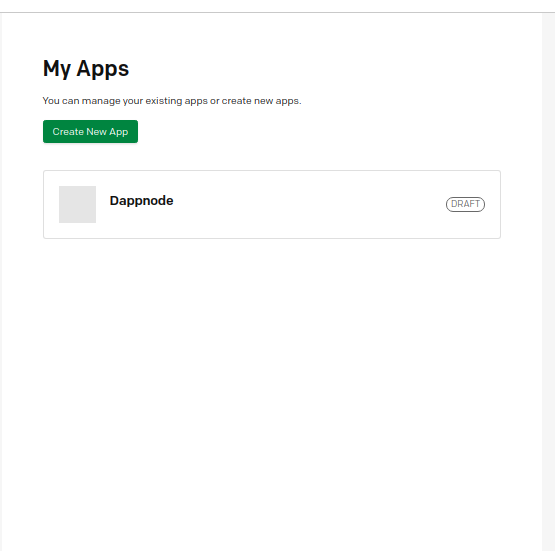

# Configuración del paquete Dms
El objetivo de esta guía es configurar un sistema de monitorización para nuestro DAppNode. 

**Índice**   
1. [Instalación del paquete DAppNode Exporter](#id1)
2. [Instalación del paquete DMS](#id2)
3. [Integración de grafana con Pagerduty](#id3)

## Instalación del paquete Dappnode Exporter

Para instalar el paquete Dappnode Exporter, simplemente escribimos en la barra de búsqueda de la DAppStore:

~~~
exporter
~~~

Mostrará el siguiente paquete: 

Hacemos click en el paquete que nos aparece, llamado Dappnode Exporter. Y hacemos click en el botón INSTALL.

Si todo ha ido bien verás algo como:

Para comprobar que funciona como es debido, y así poder ver qué es lo que hemos instalado en nuestro dappnode, hacemos click en el link "Node_exporter" que se encuentra encima del Status del paquete en la misma ventana que estabamos.

Se nos abrirá una nueva ventana en blanco, con tan solo un título y un link "Metrics", hacemos click. Y aparecerá algo como:

~~~
# HELP go_gc_duration_seconds A summary of the pause duration of garbage collection cycles.
# TYPE go_gc_duration_seconds summary
go_gc_duration_seconds{quantile="0"} 8.902e-06
go_gc_duration_seconds{quantile="0.25"} 3.43e-05
go_gc_duration_seconds{quantile="0.5"} 0.000147245
go_gc_duration_seconds{quantile="0.75"} 0.000279352
go_gc_duration_seconds{quantile="1"} 0.001784388
go_gc_duration_seconds_sum 0.014444746
go_gc_duration_seconds_count 79
# HELP go_goroutines Number of goroutines that currently exist.
# TYPE go_goroutines gauge
go_goroutines 8
# HELP go_info Information about the Go environment.
# TYPE go_info gauge
go_info{version="go1.14.6"} 1
# HELP go_memstats_alloc_bytes Number of bytes allocated and still in use.
# TYPE go_memstats_alloc_bytes gauge
go_memstats_alloc_bytes 2.561768e+06
# HELP go_memstats_alloc_bytes_total Total number of bytes allocated, even if freed.
# TYPE go_memstats_alloc_bytes_total counter
...
~~~

### ¿Qué es ésto?
Son parámetros que ha recopilado el paquete que hemos instalado, y los está exponiendo con el objetivo de que usando una herramienta como grafana podamos hacer uso de estos datos para hacer monitorización del estado de nuestra máquina. 

El siguiente paso, por tanto, es instalar el paquete Dms de DAppNode.

## Instalación del paquete DMS

Buscamos en la barra del buscador de la DAppStore:

Hacemos click sobre él y pulsamos el botón de INSTALL.

Tras acabar el proceso de instalación aparecerá la siguiente ventana:

En esta ventana de configuración del paquete Dms tenemos varias opciones:

* **Homepage**: Este link te redirigirá a repositorio en github del paquete DMS, https://github.com/dappnode/DMS#readme.
*  **Ui**: Redirige a la interfaz gráfica de grafana. Más concretamente a la sección de dashboard donde tenemos listados los paneles de monitorización que tenemos.
*  **Grafana**: Redirige a la página principal de grafana.
*  **Prometheus-Targets**: Redirige al "otro lado" de prometheus, si bien es cierto que al instalar el paquete node-exporter exponiamos las métricas del dappnode, este cliente de prometheus lo que hace es recoger esas métricas y procesarlas.
*  **Manager-Status**: Muestra los dockers que estamos monitorizando. Todos estos son recopilados en el dashboard de "dappnode-exporter dashboard".

Tras explicar brevemente qué opciones teníamos,Hacemos click en el link **Ui**. Nos aparecerá la siguiente ventana:

Haciendo click en dappnode-exporter dashboards aparecen 2 opciones:

* **Docker**: Son las métricas del sistema ,o a nivel software, es decir, cuantos recursos está usando cada uno de los paquetes de nuestro dappnode.
*  **Host**: Son las métricas de nuestra máquina a nivel "hardware", es decir; uso de memoria RAM, uso de la red, tiempo encendido, uso de la cpu general, espacio libre en disco, etc.

Si hacemos click en cualquier de las opciones, verás algo como ésto:

Ya tendrías el sistema de monitorización instalado.

En breve trataré de añadir más contenido a esta pequeña guía. 
Algunas de las cosas más interesantes y útiles que puedes hacer con grafana es Añadir alertas por telegram,email, etc en el caso de que tu máquina tenga problemas.

## Integración de grafana con Pagerduty

### ¿Qué es Pagerduty y para qué sirve?
Pagerduty es un gestor de incidentes, que nos permite integrar un sistema de notificaciones, automatizar operaciones entre otras muchas funcionalidades.

Decir que tiene un paquete gratuito, así como otros de pago. Para lo que necesitamos en esta guía con el gratuito tenemos más que de sobra, puedes obtener más información de los paquetes en [su página web](https://www.pagerduty.com/pricing/).

Aquí dejo documentación sobre la plataforma: [Pagerduty](https://support.pagerduty.com/docs/introduction)

Aunque pagerduty ofrece muchísimas posibilidades, en esta guía vamos a empezar con lo más básico, como implementar pagerduty con grafana para que nos gestione las notificaciones de las alertas.

### Creación de una cuenta en PagerDuty

El primer paso sería el de crear una cuenta en Pagerduty, para ello diríjase a [la web de registro](https://www.pagerduty.com/sign-up/), rellenando el siguiente formulario ya estariamos registrados.

Después de haber creado nuestra cuenta nos dirigiremos al dominio que hemos definido en el formulario de registro. En el ejemplo:

~~~
https://dappnode.pagerduty.com/incidents
~~~

Si no lo recordais, identificaos en la web de pagerduty y os redirigirá automáticamente.

### Obtención de la INTEGRATION KEY

Para poder integrar pagerduty con grafana necesitamos la API KEY. Para ello hay que hacer varios pasos. Decir que pagerduty permite muchísimas configuraciones que no vamos a ver aquí, por ello recomiendo una vez más que leas su documentación si estás interesado.

Tras identificarnos por primera vez, deberíamos ver una web como la siguiente:

Lo primero que vamos a hacer es crear una app, para ello debemos elegir el modo desarrollador, developer mode. Para ello, hacemos click en el icóno de los tres cuadrados con el signo más y elegimos la opción "developer mode". Como en la siguiente imagen.

Nos aparecerá la opción **Create New App**. La elegimos y nos aparecerá el siguiente formulario:

Tras completar el formulario, ahora podrás verlo listado en la página  **My Apps**, dónde le habíamos dado al botón **Create New App**.

El siguiente paso es editar los datos de la app, hacemos click en ella, y nos aparecerá un nuevo formulario. En el tenemos varios cambos, además de los anteriores.
Lo importante aquí es el apartado de ***Functionality**, seleccionamos Añadir (Add) la funcionalidad de **Events Integration**.

Al hacer click abrirá otro formulario para configurar dicha integración, lo único que hacemos es hacer click en el Botón create en la sección **Events Integration Test**. Al hacer click verás algo como ésto:

Ahora, copiamos la **Integration Key**, que en mi caso sería:
~~~
5e386468b04143378b89ebc55b62266b
~~~

Guardamos los cambios, haciendo click en Save. Y Save de nuevo en el formulario anterior.

Ya tenemos la Integration Key. El siguiente paso es crear un canal de notificaciones de grafana y configurarlo con pagerduty.

### Creación del canal de notificaciones en grafana (para pagerduty)

Abrimos elgrafana de nuestro DAppNode, para ello DAppNode > Packages > UI. [Dappnode grafana](http://dms.dappnode/dashboards).

Elegimos en la barra de la Izquierda la opción Notification channels.

Por defecto, veremos que no tenemos ningún canal de notificaciones creado. Hacemos click en el botón **Add Channel** para crear uno.

Nos aparece el siguiente formulario, lo importante aquí es seleccionar en Type = Pagerduty. Y se nos aparecerá la opción de Integration Key, ahñi debemos pegar lo que obteníamos en la app creada en pagerduty, en la funcionalidad de events integration.

Las demás opciones puedes ir probando y ver si te interesa añadir alguna.
Antes de hacer click en Save, haz click en test. 

Deberá aparecerte una notificación en verde, con el texto **Send Notificacion Send**. Es una prueba de esta notificación, puedes comprobar en el correo que usaste para registrarte en pagerduty que te habrá llegado un email avisándote de que hay un incidente. Si te ha llegado es que está configurado correctamente.

Ahora "solo" quedaría configurar las alertas, es decir, configurar cuándo o bajo que circunstancias se van a enviar estas notificaciones.

