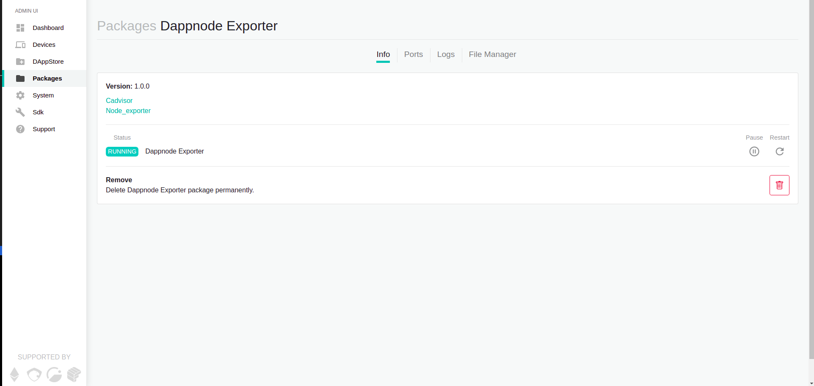
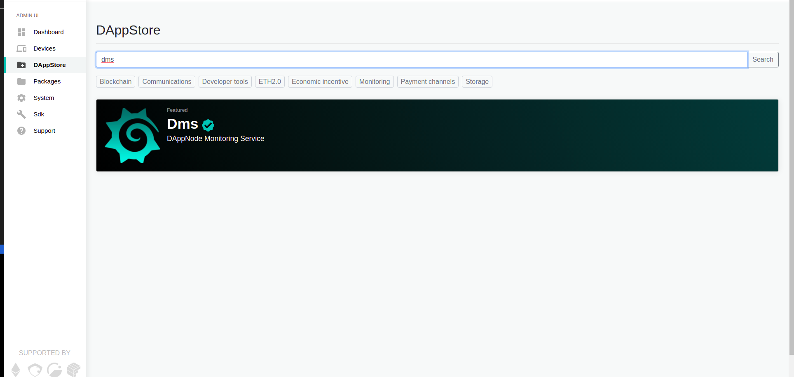

# Configuración del paquete Dms
El objetivo de esta guía es configurar un sistema de monitorización para nuestro DAppNode. 

## Instalar el paquete Dappnode Exporter

Para instalar el paquete Dappnode Exporter, simplemente escribimos en la barra de búsqueda de la DAppStore:

~~~
exporter
~~~

Mostrará el siguiente paquete: 

Hacemos click en el paquete que nos aparece, llamado Dappnode Exporter. Y hacemos click en el botón INSTALL.

Si todo ha ido corriendo verás algo como:

Para comprobar que funciona como es debido, y así poder ver qué es lo que hemos instalado en nuestro dappnode, hacemos click en el link "Node_exporter" que se encuentra encima del Status del paquete en la misma ventana que estabamos.

Se nos abrirá una nueva ventana en blanco, con tan solo un título y un link "Metrics", hacemos click. Y aparecerá algo como:

~~~
# HELP go_gc_duration_seconds A summary of the pause duration of garbage collection cycles.
# TYPE go_gc_duration_seconds summary
go_gc_duration_seconds{quantile="0"} 8.902e-06
go_gc_duration_seconds{quantile="0.25"} 3.43e-05
go_gc_duration_seconds{quantile="0.5"} 0.000147245
go_gc_duration_seconds{quantile="0.75"} 0.000279352
go_gc_duration_seconds{quantile="1"} 0.001784388
go_gc_duration_seconds_sum 0.014444746
go_gc_duration_seconds_count 79
# HELP go_goroutines Number of goroutines that currently exist.
# TYPE go_goroutines gauge
go_goroutines 8
# HELP go_info Information about the Go environment.
# TYPE go_info gauge
go_info{version="go1.14.6"} 1
# HELP go_memstats_alloc_bytes Number of bytes allocated and still in use.
# TYPE go_memstats_alloc_bytes gauge
go_memstats_alloc_bytes 2.561768e+06
# HELP go_memstats_alloc_bytes_total Total number of bytes allocated, even if freed.
# TYPE go_memstats_alloc_bytes_total counter
...
~~~

¿Qué es ésto?
Son parámetros que ha recopilado el paquete que hemos instalado, y los está exponiendo con el objetivo de que usando una herramienta como grafana podamos hacer uso de estos datos para hacer monitorización del estado de nuestra máquina. 

El siguiente paso, por tanto, es instalar el paquete Dms de DAppNode.

## Instalando el paquete DMS

Buscamos en la barra del buscador de la DAppStore:

Hacemos click sobre él y pulsamos el botón de INSTALL.

Por hacer...