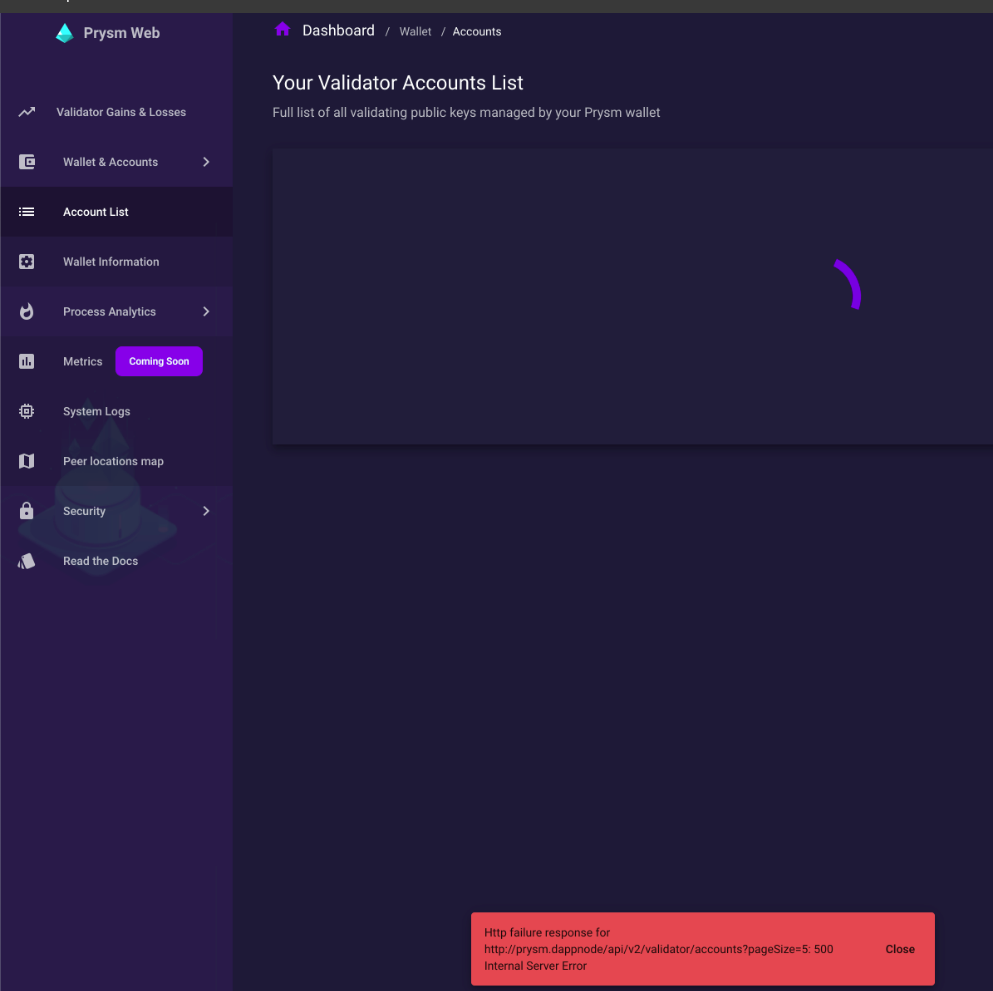
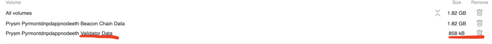

# Solución de errores

La idea principal de este repositorio es la de recopilar los errores comunes que pueden aparecer en el uso, configuración e instalación de dappnode y cómo resolverlos. Toda esta información ha sido obtenido desde el discord de dappnode y de su foro.

## Prysm 

### Error 1

~~~
Http failure response for
http://prysm.dappnode/api/v2/validator/acccount?pageSize=5:500 
Internal Server Error
~~~

La ventana que muestra el mensaje de error sería algo como :

Para solucionar este error tan solo hay que eliminar los datos del validador, solamente el "validator data" e importar las keys una vez más. En la siguiente imagen se muestra claramente qué es lo que hay que eliminar.

Después de eliminar los datos del validador, importa de nuevo solamente el archivo json "keystore-(...).json", no toda la carpeta.

#### Error 1.1

Después de seguir los pasos para solucionar el error anterior, es posible que surja este problema en la instalación:

~~~
Ports have to be opened and there is no UPnP device available
    If you are capable of opening ports manually, please ignore this error
    Your router may have UPnP but it is not turned on yet. Please research if your specific router has UPnP and turn it on

Core DAppNode Packages dappmanager.dnp.dappnode.eth, vpndnp.dappnode.eth, ipfs.dnp.dappnode.eth, bind.dnp.dappnode.eth, wifi.dnp.dappnode.eth are not found
    Make sure the disk is not too full. If so DAppNode automatically stops the IPFS package to prevent it from becoming un-usable
    Go to the System tab and restart each stopped DAppNode Package. Please inspect the logs to understand cause and report it if it was not expected.
~~~

Lo ideal sería asegurarse en primer lugar que la configuración ddel router es la adecuada, después de ello, comprobar el estado del disco duro, y finalmente, ir a la pestaña de sistema y reiniciar cada uno de los paquetes que dappnode ha parado.

### Error 2

Después de instalar Prysm, este error aparece:

~~~
"Call to packageInstall
Reply: Error verifying the image: image tarball must contain strictly one image"
~~~

Necesitas actualizar tu DAppNode, para ello ve a la pestaña de sistema-auto updates y fuerza una actualización.

Para ello, desactiva las actualizaciones automáticas del paquete system y una alerta aparecerá indicando que se va a actualizar. Recuerda reactivar el botón de actualizaciones automáticas!

## IPFS

Hay un error del protocolo IPFS con algunos tipos de routers, el equipo de dapnode está trabajando en ello!

## Conectarse SSH 

### Conectarse vía SSH estando en una red diferente

Usar el comando :

~~~
ssh dappnode@172.33.0.1
~~~

## Actualizaciones

### Actualizaciones automáticas

Es recomendable activar las actualizaciones automáticas. Puedes activarlas haciéndo click en el botón de dicho nombre en la parte superior derecha, en la epstaña de sistema.

### Actualizaciones manual

En el caso de que por el motivo que sea no quieras y prefieras actualizar de manera manual, lo que debes hacer es escribir en la barra del buscador de la DAppStore, en el caso de buscar la última versión de dappnode, escribiriamos:

~~~
core.dnp.dappnode.eth
~~~

## Dappmanager

### Se queda congelado en reseting dappmanager

Es posible que se quede como en la imagen siguiente:

No es ningún problema, lo único que hay que hacer es volver a cargar la página del navegador. Lo que está pasando es que dappmanager es el encargado de mostrarte la UI, y al reiniciarse no te ha indicado que se ha reiniciado, y queda la UI como estaba antes de reiniciar, por ello hay que recargar la página.
 
